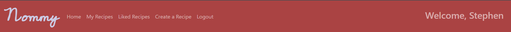

# Nommy

## Project Overview

Nommy is a meal planning app that is designed to help users decide on what to cook! A lot of people would agree that deciding on what to cook on a given night can take up time and effort but Nommy is here to help you make your decision.

The app is essentially a database of recipes that also allows users to add their own recipes to those already on the site. Additional functionality is also here allowing users to create profiles, create their own recipes and like other user recipes, basically giving them a virtual cookbook!

Please find the deployed site [here](https://nommy2022.herokuapp.com/).

 

## User Experience (UX)

### User Stories

#### Epic - User Navigation
- As a first time user of the site, I want to immediately understand the content of the site and decide if it suits my needs.
- As a site user, I want the app layout in a way that allows me to navigate intuitively, through well designed navigation bars and page content.
- As a site user, I want to view a paginated list of recipes, so I can decide on which one to view.
- As a site user, I want to be able to click on a recipe to view the ingredients, cook time and method of cooking.
- As a site user, I want to be able to view the number of likes on each recipe so that I can see which is the most popular.

#### Epic - User Profile
- As a site user, I want to be able to create my own account so I can create my own recipes, save existing recipes as favourites and comment/like other users recipes.
- As a registered site user, I want to be able to log in and log out of my account safely and securely.

#### Epic - Recipe Interaction
- As a registered user, I want to be able to add recipes to my likes list so I can find them easily in future.
- As a registered user, I want to be able to create my own recipes to add to the app.
- As a registered user, I want to be able to edit recipes I have created, for example to add tips, or make other changes.
- As a registered user, I want to be able to view my favourite recipes in one location.
- As a registered user, I want to be able to view the recipes I have created in one location.
- As a registered user, I want to be able to comment on other recipes and leave feedback.
- As a registered user, I want to be able to like other recipes to help bring them to the attention of other users. 

#### Future Implementations
- User profile page: - As a site user, I want to be able to view my statistics such as how many recipes I've added, how many I have in my favourites and how many recipes I've commented on.
- Sharing recipes: - As a site user, I want to be able to view and share receipes with my friends.

 

### Design

The site layout and navigation are intended to be very sleek and simplistic with the focus being on the recipes on display. 

#### Colour Scheme

The dark shades of colour on the page are to make the user feel comfortable. Font color is also changed where needed to match the background.

#### Imagery

All imagery on site is uploaded by users and displayed with their relevant recipe. The site includes a placeholder image also if a user has no image to upload.

#### Typography

The font Cedarville Cursive was used for the "Nommy" logo in the navbar. The font family Aref Ruqaa Ink is used for recipe titles and creator names. These fonts were chosen as they fit the elegant design of the site. For informative text regarding ingredients and methods, Roboto is used for its readibility. In all cases, sans-serif is set as the default font.

 

#### Wireframes

1. Please see desktop wireframes [here](documentation/wireframes/desktop.png).
2. Please see tablet wireframes [here](documentation/wireframes/tablet.png).
3. Please see mobile wireframes [here](documentation/wireframes/mobile.png).

 

## Features

### The Navbar

The Nommy navbar features links to other pages on the site. When the user is not logged in, they will only see the logo, register and sign-in links. When the user logs in however, they are able to see links to their "my recipes" and "liked recipes" pages. The users name is also displayed along with a welcome message on the right-hand side of the navbar.

### The Footer

The Nommy footer is simple and just includes the copyright logo and links to Nommy social media.

### Home page

The site home page lists recipes created by users. On the home page, only the dish name, creator and image are visible.

### View Recipe Page

When a user clicks on the recipe title, they are brought to the recipes page which includes all of the information the user needs on ingredients, method and cooking time.

### Log in page

The site includes a user authentication app, thanks to Django Authentication.

### Register page

The site includes a user authentication app, thanks to Django Authentication.

### Sign out page

The site includes a user authentication app, thanks to Django Authentication.
 

### Create recipe

The site includes a user form to create new recipes to add to the site. Summernote widgets are used here to provide more user freedom.

### Update recipe

The site includes a user form to create new recipes to add to the site. Summernote widgets are used here to provide more user freedom. Only the creator of the recipe can update it and it is pre-populated from the existing database record.

### Delete recipe

The site includes a short form allowing users to delete recipes they no longer want. Only the creator of the recipe can update it.

### Likes / Liked Recipe page

When a user leaves a like on a recipe, the recipe is also added to this page so the user can view all of their liked recipes in one location.

### Comments

Beneath each recipe, comments from users are displayed. Further below is the form the user can fill in for a new comment.

### My Recipes page

When a user creates a recipe, the recipe is also added to this page so the user can view all of their created recipes in one location. They are also told which recipes are published and which are still drafts.

 

## Agile Methodology

The agile methodology was used in developing this project through Github projects. 

The 3 user story epics above were broken down into Milestones on the Github project and each user story in the given Milestone was further broken down into individual issues to facilitate completion of each user story.

Please view the Github projects board [here](https://github.com/users/StephenB92/projects/4).

 

## Data Models

Custom models are used throughout the project.

The Django AllAuth feature is used for user authentication. To facilitate users creating their own recipes, a custom recipe model is required. The creator of the recipe is set as a foreign key to the AllAuth user model as a recipe should only have one creator. 

To facilitate users commenting on recipes, a custom comment model is required. Here, the recipe is the foreign key as a comment can only relate to one recipe.

You can view the details of the database schema [here](documentation/database-schema/database-schema.png).

 

## Technologies Used

### Coding Languages Used
1. HTML5
2. CSS3
3. Python

### Frameworks, Libraries and Online Tools
* Django
* Bootstrap
* Github - used for agile method of planning and for version control of the project
* Heroku - used for site deployment
* PostgreSQL - database used on heroku
* Lucidchart - used to map the database schema
* Balsamiq - used to create wireframes
* Cloudinary - used for database image storage
* Django Allauth for user authentication
* Summernote - used for users to edit text
* Crispy forms - used to create forms

 

## Deployment - Heroku

### To deploy this page to Heroku from its GitHub repository, the following steps were taken:

### Create the Heroku App:
- Log in to Heroku or create an account.
- On the main page click the button labelled New in the top right corner and from the drop-down menu select "Create New App".
- Enter a unique app name.
- Next select region.
- Click on the Create App button.
### Attach the Postgres database:
- In the Resources tab, under add-ons, type in Postgres and select the Heroku Postgres option.
- Copy the DATABASE_URL located in Config Vars in the Settings Tab.
### Prepare the environment and settings.py file:
- In your code editor, create an env.py file in the main directory.
- Add the DATABASE_URL value and your chosen SECRET_KEY value to the env.py file.
- Update the settings.py file to import the env.py file and add the SECRETKEY and DATABASE_URL file paths.
- Comment out the default database configuration.
- Save files and make migrations.
- Add Cloudinary URL to env.py
- Add the cloudinary libraries to the list of installed apps.
- Add the STATIC files settings - the url, storage path, directory path, root path, media url and default file storage path.
- Link the file to the templates directory in Heroku.
- Change the templates directory to TEMPLATES_DIR
- Add Heroku to the ALLOWED_HOSTS list the format ['app_name.heroku.com', 'localhost']
### Create files / directories
- Create requirements.txt file
- Create three directories in the main directory; media, storage and templates.
- Create a file named "Procfile" in the main directory and add the following: web: gunicorn project-name.wsgi
### Update Heroku Config Vars
- Add the following Config Vars in Heroku:
SECRET_KEY value 
CLOUDINARY_URL 
PORT = 8000 
DISABLE_COLLECTSTATIC = 1

 

## Security/Authentication Features

### User Authentication
- The LoginRequiredMixin is used to redirect unauthenticated users to the login page and prevent them from accessing secure pages.

### Form Validation

If required areas of the user forms are left blank, the form will not submit and a warning will notify users as to what fields are causing the error.

### Database security
- The database url and secret key are stored in the env.py file to prevent unwanted connections to the database. The env.py file is included in the .gitignore file.
- Cross-Site Request Forgery (CSRF) tokens were used on all forms.

 

## Testing

### Validators

#### Python - pep8
- Each custom python file was based through [PEP8](http://pep8online.com/). The custom files admin.py, forms.py, models.py, tests.py, urls.py and views.py were tested and each passed.

1. Forms.py result
 

2. Admin.py result
 

3. Models.py result
 

4. Urls.py result
 

5. Views.py result
 

 

## Manual Testing

The below manual tests were carried out prior to submission

 

### Unregistered User

1. Index page (incl nav and footer)
- When a user lands on the page, if they click on a recipe title, they are brought to the recipe detail view.
- Clicking on the "Nommy" logo, the user is returned to the home page.
- CLicking on the register link brings the user to the register page.
- Clicking on the sign in link brings the user to the login page.
- The footer includes links to social media such as Facebook, Instagram, Linkedin and Youtube. Each link works and opens the relevant site in a new tab.

2. Forms
- All forms (login, register, create recipe and update recipe) are working correctly and saving the correct information to the database. The form also will not be saved or submitted if a field is left empty and the page flags which fields need completion.

3. My recipe page
- The unregistered user is prevented from accessing this page (via url) thanks to the LoginRequiredMixin included the the views.py file for this page. They are instead directed to the login page.

4. Create recipe page
- The unregistered user is prevented from accessing this page (via url) thanks to the LoginRequiredMixin included the the views.py file for this page. They are instead directed to the login page.

5. Liked recipe page
- The unregistered user is prevented from accessing this page (via url) thanks to the LoginRequiredMixin included the the views.py file for this page. They are instead directed to the login page.

6. Recipe detail page
- No interactive elements on the recipe detail page appear to the unregistered user.

7. Update recipes page
- The unregistered user is prevented from accessing this page (by adding "/updaterecipe" after the recipe url) thanks to the LoginRequiredMixin included the the views.py file for this page. They are instead directed to the login page.

8. Delete recipes page
- The unregistered user is prevented from accessing this page (by adding "/deleterecipe" after the recipe url) thanks to the LoginRequiredMixin included the the views.py file for this page. They are instead directed to the login page.

### Registered User

1. Index page (incl nav and footer)
- When a user lands on the page, if they click on a recipe title, they are brought to the recipe detail view.
- Clicking on the "Nommy" logo, the user is returned to the home page.
- For the logged in user, the navbar items change to include the my recipes, liked recipes and create recipes links. Each link has been confirmed to work and brings the user to the correct html page.
- The logout link also works and brings the user to the logout page.
- The footer includes links to social media such as Facebook, Instagram, Linkedin and Youtube. Each link works and opens the relevant site in a new tab.

2. Forms
- All forms (login, register, create recipe and update recipe) are working correctly and saving the correct information to the database. The form also will not be saved or submitted if a field is left empty and the page flags which fields need completion.

3. My recipe page
- The users created recipes appear correctly on the page and with the correct tags as to them being draft or published. For convenience, the edit/delete buttons appear under each user created recipe on this page. Both links work and bring the user to the relevant dorm. The user can click on the recipe title to be brought to the detailed view.

4. Create recipe page
- The user is brought to this form after clicking the navbar link. As mentioned above, this form is not submitted unless all details are completed. The forms have been confirmed to work as the site is immediately updated with the new recipe and also appear in the admin panel.

5. Liked recipe page
- The users liked recipes appear on this page. Similar to the index page. The recipes appearing are appearing as they should. They are also immediately removed from the liked recipes page if the user then unlikes the recipe. As usual, the user clicks the recipe name to be brought to the detail page.

6. Recipe detail page
- The likes functionality has been confirmed to work (particularly evidence by the liked recipes appearance in the liked recipes page) and the likes count works as it should also. Comments are also on display below and registered users can add comments also. This is confirmed to work as the comments immediately appear and the database is updated. Also, if the user is the creator of the recipe, the edit and delete buttons appear thanks to some django logic included in the template. This is confirmed to work also as the buttons only appear if the user is the creator and bring the user to the update or delete page. Django logic is also used so that the user/creator of a given recipe cannot like their own recipes, but the count still appears. A user can still comment on their recipes (for example to respond to a comment).

7. Update recipes page
- If the user clicks the update button under their recipe (in the detail page or in the my recipes page) they are immediately brought to the update recipes page. The form is also prepopulated with the existing data for the specific recipe so the user can amend where they like. As mentioned above, this form is not submitted unless all details are completed. The forms have been confirmed to work as the recipe is immediately updated and also appear in the admin panel. A "cancel" button is also present here if the user changes their mind and they are brought to that recipes detail page. Django logic is used in the html file to only display the form on the page if the current user id matches that of the recipe creator. Otherwise, they are met with a message saying that they do not have permission to update the recipe and are then prompted to return to their my recipes page. This has been tested and confirmed to work as a way of preventing users from changing other users data.

8. Delete recipes page
- If the user clicks the delete button under their recipe (in the detail page or in the my recipes page) they are immediately brought to the delete recipes page. A message asking the user if they're sure they want to delete the recipe appears along with a delete button. The delete button is confirmed to work as the recipe is immediately removed. Django logic is used in the html file to only display the form on the page if the current user id matches that of the recipe creator. Otherwise, they are met with a message saying that they do not have permission to delete the recipe and are then prompted to return to their my recipes page. This has been tested and confirmed to work as a way of preventing users from changing other users data.

### JavaScript
- JavaScript is used to display messages to the user, depending on their actions. All user actions have been tested also (create/update/delete recipe, leave comment, login/logout/signup) and in all cases, a message is displayed to the user confirming the action has been successful.

 

## Bugs and Fixes

- While coding the comment functionality, I kept receiving an error where a user can only post one comment across the entire site. This appears to have been an issue due to a migration I had made in the early stages of the project which de-syncronised my database. This resulted in me having to completely restart my database, including tables, so it could syncronised. This has fixed the issue and a user can now comment on as many recipes and as many times as they like.
- There is a bug where the users previously typed comment remains in the comment form after their comment has been posted. As this issue only appeared in late stages of the project and near the dealine, this issue will have to be fixed in a future update.
- While creating the CRUD functionality of the site and then bug testing, I saw while playing around with the urls that any user of the site (registered or not) could edit and delete recipes by typing /updaterecipe or /deleterecipe in the url adter the currently viewed recipe. To solve this, I used the LogInRequiredMixin from the Django Authentication system, which redirects unregistered users to the login page (credit below). For other registered users, I used if else statements using Django logic in my update recipe and delete recipe pages. These statements checked if the logged in user matches the "creator" of the recipe. If these don't match, the form will not appear to the user and they are redirected to their "my recipes" page. Credit below.
- While testing the project, I realised that user uploaded images from the site were not being saved to Cloudinary. After researching om W3S, I found that the "enctype" attribute with the value of "multipart/form-data" was required here. Credit below.
- At an earlier stage of development, I received a notification from Git Guardian that my database details had been exposed in my last commit. I reviewed my commit history and saw that my .vscode/launch.json had exposed the details and was not included in my .gitignore file. This required me to re-write my commit history to remove the data and ensure the file was in my .gitignore file going forward. Credit below.
- I have had difficulty setting the images uploaded by users on the site at a default size, in order to keep all recipe items uniform. I was unable to resolve this issue prior to the deadline. This will have to be included in a future update.

 

## Credits 

- The Code Institute Walkthrough Project: "I think therefore I blog".
- Pexels for the stock images used in this project.
- BBC Goodfoods for recipe information used on the site.
- Credit to [this](https://stackoverflow.com/questions/837828/how-do-i-create-a-slug-in-django) post on Stack Overflow which solved an issue with new recipes not generating new slugs.
- Credit to [this](https://stackoverflow.com/questions/57710135/how-to-print-the-string-value-of-a-choices-field) post on Stack Overflow where I found code to display the status of users recipes as strings on the "My Recipes" page.
- Credit to [this](https://www.youtube.com/watch?v=aStLddXMJrk&list=WL&index=3&ab_channel=CodingEntrepreneurs) video on Youtube by CodingEntrepreneurs which helped with code for pre-populating the user form in the update view.
- Credit to [this](https://stackoverflow.com/questions/47636968/django-messages-for-a-successfully-delete-add-or-edit-item) post on Stack Overflow where I found code to provide a successful deletion message to the user. This was necessary as the SuccessMessageMixin does not work in a DeleteView.
Credit to the [Django Documentation](https://docs.djangoproject.com/en/4.0/ref/contrib/messages/) for information on inserting the recipe title to display in success messages.
- Credit to the [Django Documentation](https://docs.djangoproject.com/en/4.1/topics/auth/default/) for information on the LoginRequiredMixin.
- Credit to [this](https://stackoverflow.com/questions/13713077/get-user-information-in-django-templates) article on Stack Overflow for code displaying username on the base.html file.
Credit to [this](https://www.youtube.com/watch?v=Y1Us5jVT07E&ab_channel=Codemy.com) video on Youtube for the information on if else statements checking if the logged in user matches the "creator" of the recipe.
- Credit to [W3S](https://www.w3schools.com/tags/att_form_enctype.asp) for the information on "enctype" attribute which is necessary for users uploading files as part of recipe creation.
- Credit to [this](https://dev.to/sophie/how-to-delete-a-secret-file-from-github-ing) article on Dev.to which provided information on how to re-write my commit history to remove the exposed secret data.

## Acknowledgements
- My mentor Narender Singh for continuous helpful feedback.
- Tutor support and student care at Code Institute for their support.